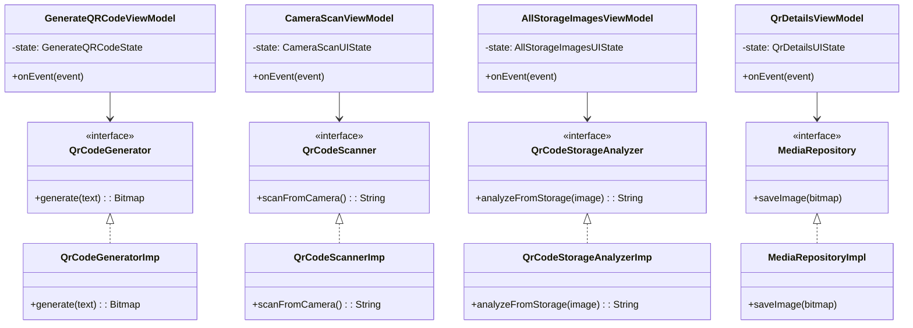
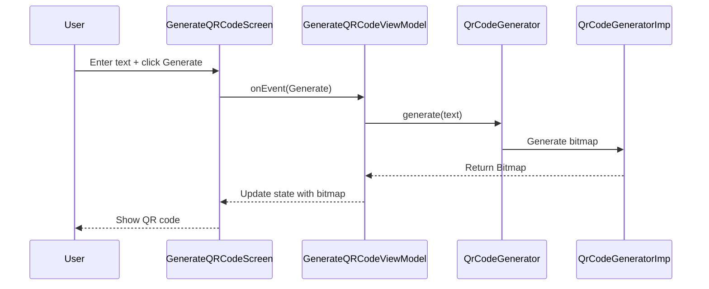
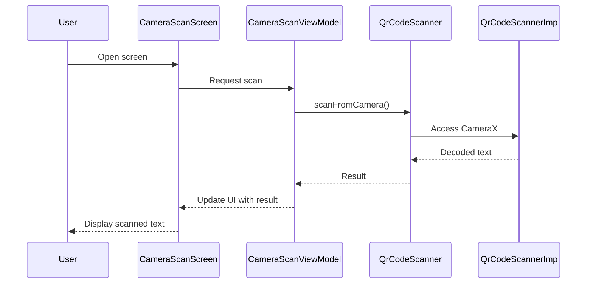
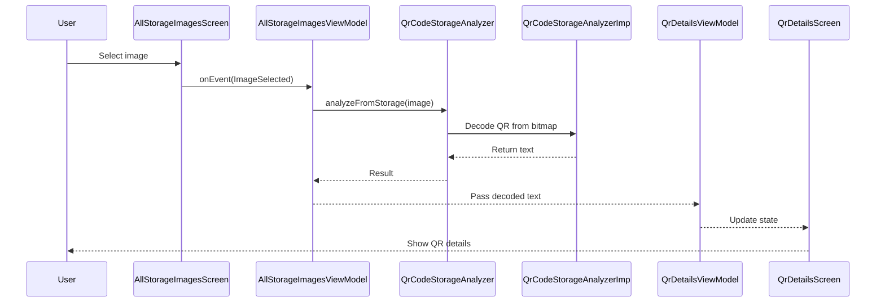

```markdown
# 🏗️ Architecture Documentation

This project follows **Clean Architecture + MVI** with feature-based packaging.  
The diagrams below describe the relationships between layers and the main data flows.

---

## 🔑 High-Level UML Diagram



---

## 📱 Sequence Diagrams

### QR Code Generation


### Camera Scan


### Storage Image Scan


---