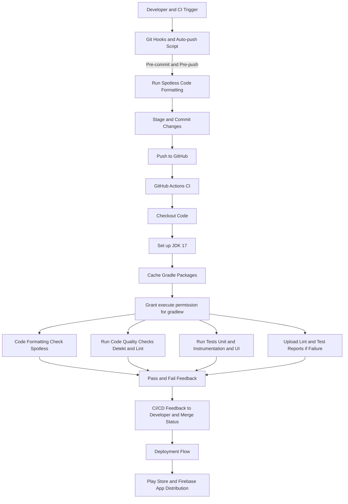

## 🔑  Flowchart Diagram

```mermaid
flowchart TD
A[Developer and CI Trigger] --> B[Git Hooks and Auto-push Script]

    B -->|Pre-commit and Pre-push| C[Run Spotless Code Formatting]
    C --> D[Stage and Commit Changes]
    D --> E[Push to GitHub]

    E --> F[GitHub Actions CI]

    F --> G[Checkout Code]
    G --> H[Set up JDK 17]
    H --> I[Cache Gradle Packages]
    I --> J[Grant execute permission for gradlew]

    J --> K[Code Formatting Check Spotless]
    J --> L[Run Code Quality Checks Detekt and Lint]
    J --> M[Run Tests Unit and Instrumentation and UI]
    J --> N[Upload Lint and Test Reports if Failure]

    K --> O[Pass and Fail Feedback]
    L --> O
    M --> O
    N --> O

    O --> P[CI/CD Feedback to Developer and Merge Status]

    P --> Q[Deployment Flow]
    Q --> R[Play Store and Firebase App Distribution]
```

---