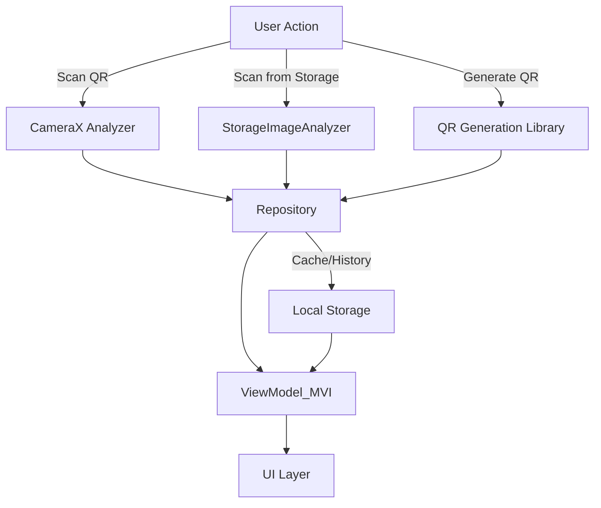

## 🔑  Flowchart Diagram

```mermaid
flowchart TD
    A[User Action] -->|Scan QR| B[CameraX Analyzer]
    A -->|Scan from Storage| C[StorageImageAnalyzer]
    A -->|Generate QR| D[QR Generation Library]

    B --> E[Repository]
    C --> E
    D --> E

    E --> F[ViewModel_MVI]
    F --> G[UI Layer]

    E -->|Cache/History| H[Local Storage]
    H --> F
```

---