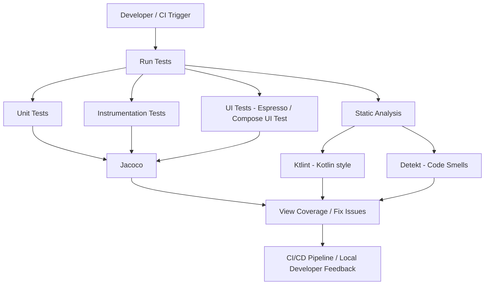

## 🔑  Flowchart Diagram

```mermaid
flowchart TD
A[Developer / CI Trigger] --> B[Run Tests]

    B --> C[Unit Tests]
    B --> D[Instrumentation Tests]
    B --> E[UI Tests - Espresso / Compose UI Test]

    C --> F[Jacoco]
    D --> F
    E --> F

    B --> G[Static Analysis]
    G --> H[Ktlint - Kotlin style]
    G --> I[Detekt - Code Smells]

    F --> J[View Coverage / Fix Issues]
    H --> J
    I --> J

    J --> K[CI/CD Pipeline / Local Developer Feedback]
```

---